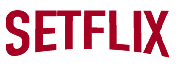
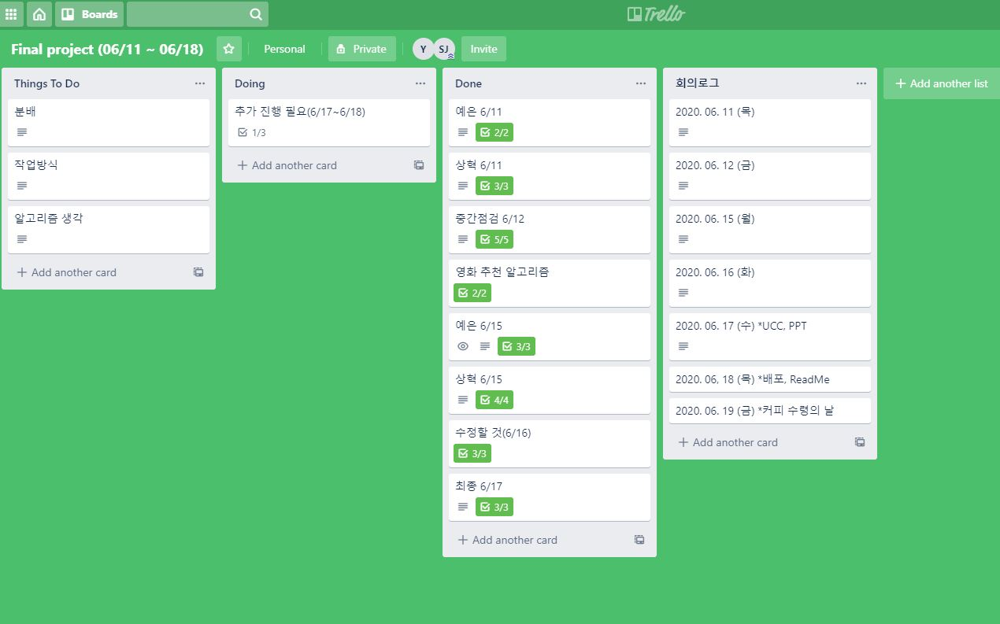
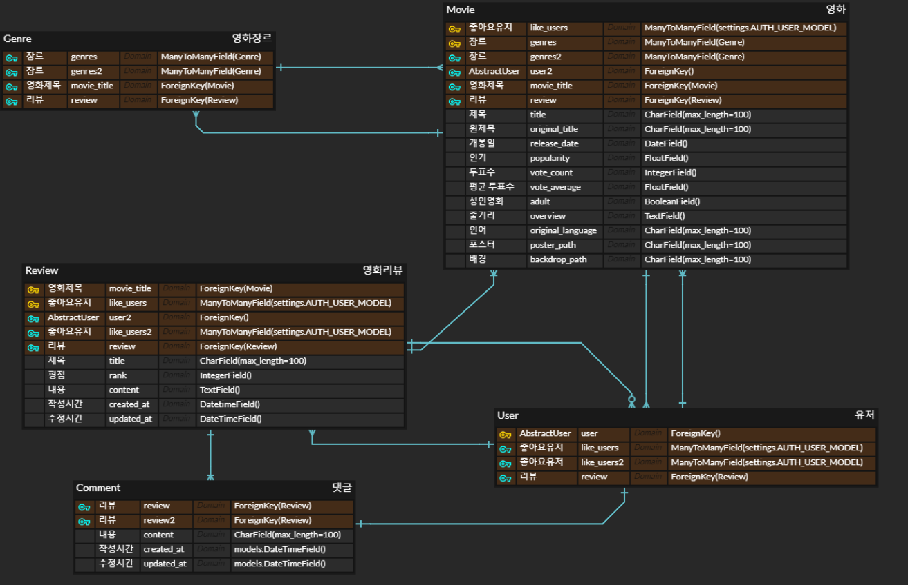
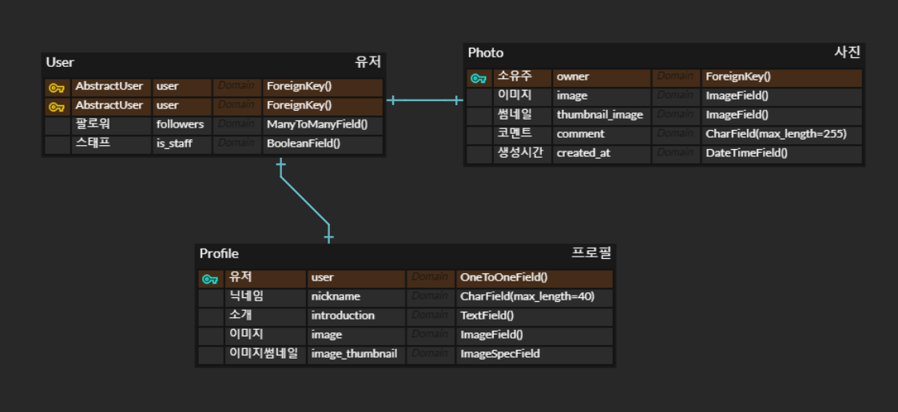
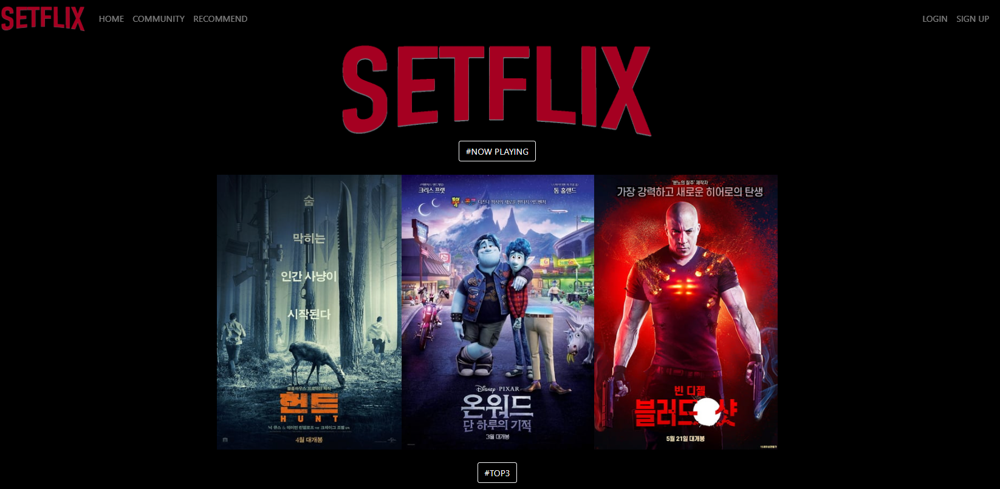
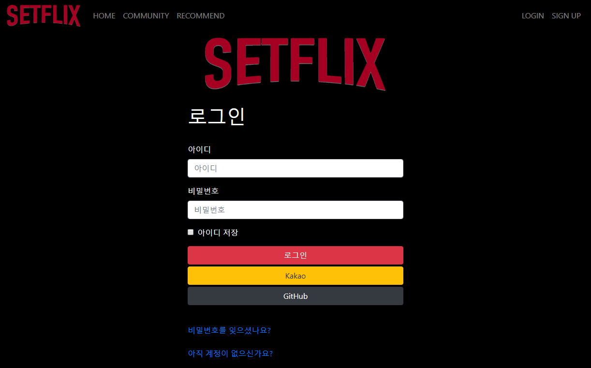
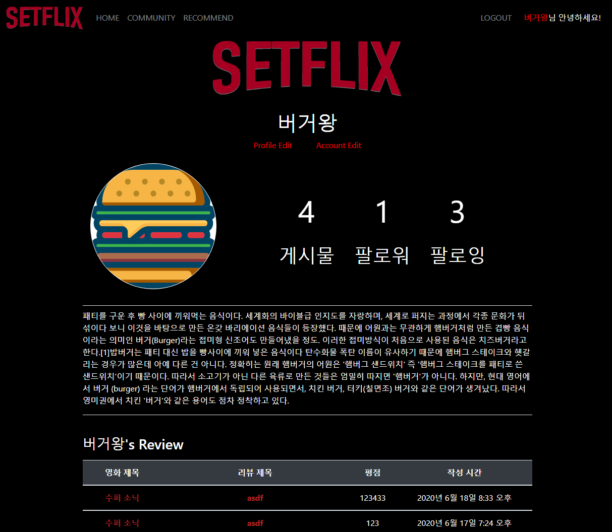
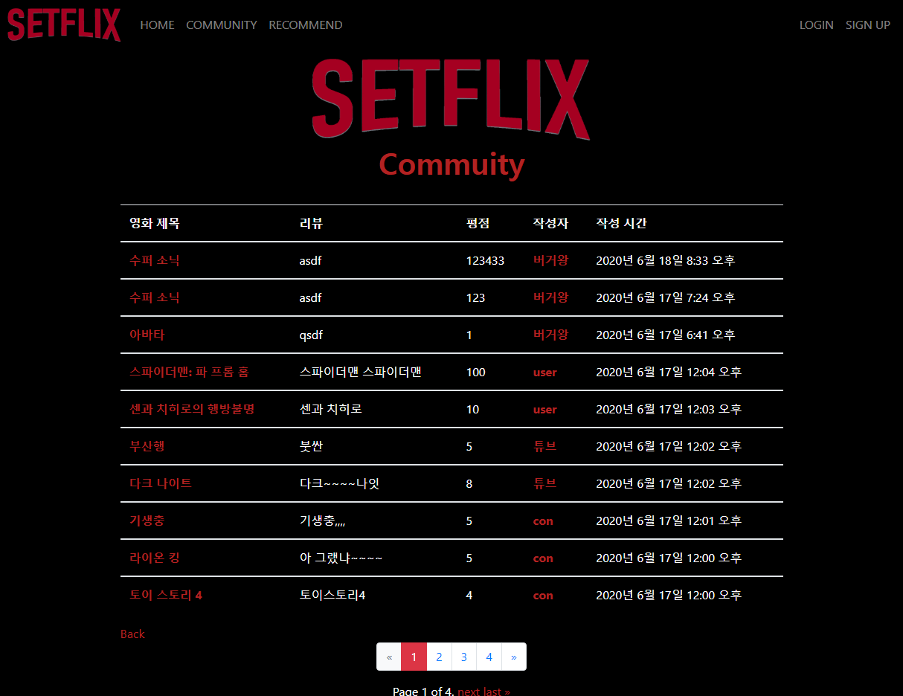
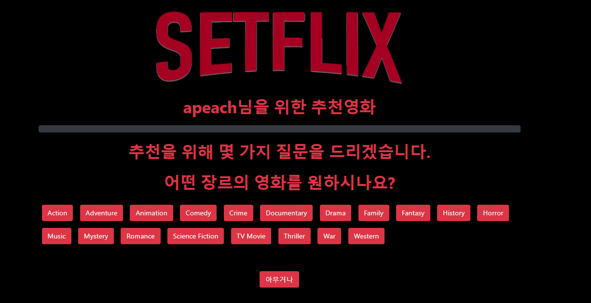

### * 종합 프로젝트 *

---

- 목차
  - 프로젝트 및 팀 소개
  - 개발 일정 및 역할 분담
  - 모델링
  - 필수 기능 설명
  - 배포 서버 URL
  - 느낀점

---

#### * 프로젝트 및 팀 소개

0. __프로젝트 구조__
   - Django & Vanilla JS 를 활용한 프로젝트 구현
   - 프로젝트 구조 설명
     - venv 가상환경
     - final_pjt폴더 안에 final_pjt, movies App, accounts App으로 구성됨.
     - 추가적으로 googlelogin, 이용자들의 프로필 사진이 담겨있는 media, 전체 template폴더, README로 구성됨.
     
     

1. 팀 명 및 팀원

- 팀명: __SETFLIX__ ( 누구나 이용 가능한 영화 추천 웹 서비스)
- 팀원: 구미 2반 전상혁(팀장), 문예은(팀원)

2. 프로젝트 목적 및 목표 서비스

- 목적

  - 넷플릭스, 왓챠 등 글로벌 OTT 시장이 점점 커져가는 가운데, 이에 대응할 수 있는 영화 추천 웹 서비스 플랫폼을 만들고자 함. 
  - 팀명 __셋__FLIX에서 알 수 있듯 영화를 3개씩 추천하는 프로세스를 갖춤.

- 목표 서비스

  - 간편한 SNS 소셜 로그인 서비스
  - 나만의 프로필 페이지
  - 팔로잉 기능으로 다른 사용자와의 소통
  - 영화 정보 확인 및 사용자들이 작성한 영화 리뷰 확인
  - 역대 최고 평점의 TOP3, 현재 상영중인 NOW PLAYING 영화 소개
  - 데이터 베이스에 저장된 영화 장르별로 추천
  - 추천 배너에서 영화 선호도 설문조사 후 취향에 따른 영화 추천
  - 사이트 관리자, 스태프로 권한을 나누어 회원 및 작성 글 관리
  - _실시간 채팅 기능_

  - _게시글, 댓글, 좋아요 수에 따른 회원 등급제 운영_

- 기대효과

  - 영화에 대한 정보를 하나의 웹 페이지에서 즉각적으로 확인 가능
  - 영화 리뷰를 직접 작성할 수 있는 회원 참여형 사이트
  - 다른 회원과의 소통으로 영화 취향이 비슷한 사람과 소통 가능

- 실제 구현 정도

  - 실시간 채팅 및 회원 등급제 운영 두가지 서비스를 제외한 목표 서비스 구현 완료.

---

#### * 개발일정 및 역할 분담

- 매일 오전, 오후 두 번의 회의
- __trello__를 활용하여 회의록 작성 및 역할 분담
  - 
  - 전상혁:  소셜 로그인, 프로필 기능 및 추천 알고리즘
  - 문예은: 전반적인 커뮤티니, 홈 화면, CSS
- 6/11 - 6/12
  - 추천 알고리즘을 제외한 기본적인 동작 구현
  - 추가적으로 필요한 진행 사항을 확인하기 위해 1차 CSS
- 6/15
  - 프로필 페이지 구현
  - 새로운 api를 활용한 영화 추천
- 6/16
  - 영화 추천 알고리즘
  - 프로필, 댓글, 커뮤니티 작성 글 등 사용자가 이용하기에 편리한 방법으로 수정
- 6/17
  - 이용자 지향의 웹 페이지를 만들기 위헤 전체적인 CSS
  - 문예은(PPT)
    - 팀 소개, 프로젝트 개요 및 기능 소개
  - 전상혁(UCC)
    - 프로젝트 시연
- 6/19
  - 배포 및 README 작성

---

#### * 모델링

- ERD
  - `MOVIES` app
  
    
  
  - `ACCOUNTS` app
  
    
- Database
  - The Movie Database(TMDb)에서 영화 데이터 수집
    - 역대 최고 평점의 영화 API 활용
    - 현재 상영중인 now playing API 활용
    - 256개의 영화 데이터 수집 (영화 제목, 원제목, 장르, 줄거리, 포스터 등)

---

#### * 필수 기능

- `HOME` 화면
- 
  - 셋플릭스만의 로고 제작
  - navbar에서 커뮤니티로 이동 가능, 영화 추천을 위한 설문조사 배너로 이동 가능
  - 현재 상영중인 #now playing 영화 소개
  - 역대 최고 평점의 #TOP3 영화 소개
  - 데이터베이스에 저장된 19개의 영화 장르별 랜덤으로 3가지 영화 추천
    - 영화는 새로고침할 때 마다 랜덤으로 바뀜
    - 영화 장르의 순서 또한 새로고침 시 바뀜
  - 영화 포스터, 영화 제목, 정보를 알려주는 (i) 버튼을 눌렀을 때 영화 디테일 페이지로 이동할 수 있게 함.
- `LOGIN` 및 `SIGNUP`
- 
  - 간편한 회원가입 (이름, 이메일 ,비밀번호)
  - 사용자경험 UX를 향상시키기 위한 소셜 로그인 기능(구글, 카카오, 깃헙 계정 로그인)
  - 관리자, 스태프의 업무를 분류하여 유저 관리 및 작성 글 관리
- __회원 전용 서비스__
- `PROFILE`
- 
  - 나만의 프로필 사진 및 자기 소개
  - 팔로우, 팔로잉 기능을 통해 다른 이용자와의 소통
  - 이용자가 작성한 전체 글 목록 표시
- `COMMUNITY`
- 
  - 리뷰 페이지
    - 모든 이용자가 작성한 영화 리뷰 및 평점 확인
    - 다른 이용자의 글을 좋아요, 댓글 작성을 통해 소통 가능
  - 영화 디테일 페이지
    - 영화 줄거리, 개봉일, 장르 등을 영화 디테일 페이지에 표시
    - 글 작성을 통해 해당 영화에 관련된 리뷰 작성 가능
- `RECOMMEND` 당신을 위한 추천 영화
- 
  - 간편한 설문 조사를 통해 회원만을 위한 추천 영화
  - 원하는 장르, 국내-해외 영화, 평점에 대한 회원의 선호도를 조사하여 그에 알맞는 영화 추천
  - 설문조사가 귀찮은 사용자를 위한 `아무거나` 버튼 영화 추천 서비스

---

#### * 배포 URL

​	- ~~http://52.78.228.178/movies/~~ (현재 폐쇄됨)

#### * 느낀점

- 1주일간의 프로젝트를 통해 이때까지의 학습 내용과 관통 프로젝트를 복습, 및 적용할 수 있어서 좋았음.
- 복습과 적용에서 더 나아가 필요한 부분은 검색과 공식 문서를 통해 새로운 방법으로 구현하여 한발짝 더 나아가는 계기가 되었음.
- 팀원과의 협업을 통해 매일 소통하며 프로젝트를 진행하였고, 소통 능력과 협업 능력을 기름과 동시에 더 나은 프로젝트를 구현할 수 있었음.
  - 특히, 오류가 나거나 모르는 부분은 팀원과 '함께' 해결함.
  - 혼자라면 구현하지 못했을 많은 부분을 팀원의 도움으로 해결할 수 있어서 좋았음.
- 직접 배포하는 최종 프로젝트이다 보니, 이때까지 구현했던 다른 프로젝트와는 다르게 UI/UX 디자인에 비중을 두었고, 사용자가 어떻게 하면 좀 더 편리하게 사이트를 활용할 수 있을지에 관해 함께 많은 고민을 나누었음.